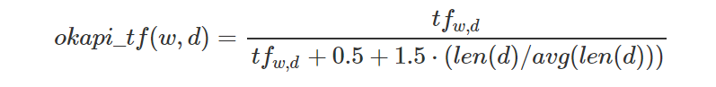
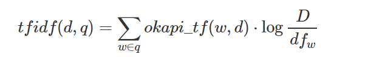
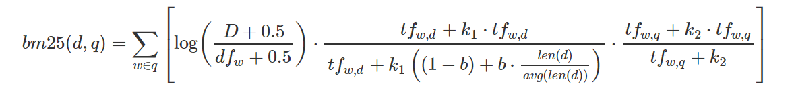
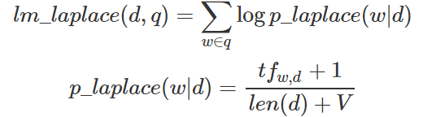
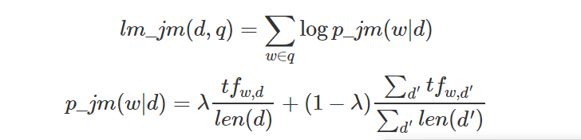

# Info Retrival Models

## Goal
__Implement and compare various retrieval systems using vector space models and language models__

The project contains two parts:
  1. A program to parse the corpus AP89_DATA.zip files and index it with [ElasticSearch](https://www.elastic.co/products/elasticsearch) 
  2. A query processor, which runs queries from an input file using a selected retrieval model

## Dataset
This project uses trec_ap89 corpus of 84000 files that can be found from [TREC](http://trec.nist.gov/data.html).

## Document Indexing
  * Use **Jsoup** to read HTML formated files from the dataset.
  * Parse them to **json** format by [google-gson](https://github.com/google/gson).
  * Use HTTP client to upload json files to a local [ElasticSearch](https://www.elastic.co/products/elasticsearch) using its [REST API](https://www.elastic.co/guide/en/elasticsearch/reference/5.2/docs.html)
  
## Query Execution
For each given query, implement document ranking by five retrival models
  * Vector space models: `Okapi-TF` and `TF-IDF`.
  * Language models: `Okapi BM25`, Unigram LM with `Laplace` smoothing and Unigram LM with `Jelinek-Mercer` smoothing.
Retrieving information such as `term frequency` and `document frequency` from the local ElasticSearch [REST API](https://www.elastic.co/guide/en/elasticsearch/reference/5.2/docs.html)

## Models Explained: 
#### Okapi TF
This is a vector space model using a slightly modified version of TF to score documents. The Okapi TF score for term frequency in document frequencyis as follows.


Where:
tfw,dtfw,d is the term frequency of term ww in document dd
len(d)len(d) is the length of document dd
avg(len(d))avg(len(d)) is the average document length for the entire corpus
The matching score for document dd and query qq is as follows.

#### TF-IDF
This is the second vector space model. The scoring function is as follows.



Where:
DD is the total number of documents in the corpus
dfwdfw is the number of documents which contain term ww
Okapi BM25

#### BM25 is a language model based on a binary independence model. Its matching score is as follows.



Where:
tfw,qtfw,q is the term frequency of term ww in query 
k1k1, k2k2, and bb are constants. You can use the values from the slides, or try your own.

#### Unigram LM with Laplace smoothing
This is a language model with Laplace (“add-one”) smoothing. We will use maximum likelihood estimates of the query based on a multinomial model “trained” on the document. The matching score is as follows.



Where:
VV is the vocabulary size – the total number of unique terms in the collection.


#### Unigram LM with Jelinek-Mercer smoothing
This is a similar language model, except that here we smooth a foreground document language model with a background model from the entire corpus.



Where:
λ∈(0,1)λ∈(0,1) is a smoothing parameter which specifies the mixture of the foreground and background distributions.

## Elastic Search Setting 
  ```
DELETE /ap_dataset

PUT /ap_dataset/
{
  "settings": {
    "index": {
      "store": {
        "type": "fs"
      },
      "number_of_shards": 1,
      "number_of_replicas": 1
    },
    "analysis": {
      "analyzer": {
        "my_english": { 
          "type": "english",
          "stopwords_path": "stoplist.txt" 
        }
      }
    }
  }
}

PUT /ap_dataset/document/_mapping
{
  "document": {
    "properties": {
      "docno": {
        "type": "keyword",
        "store": true
      },
      "text": {
        "type": "text",
        "store": true,
        "term_vector": "with_positions_offsets_payloads",
        "analyzer": "my_english"
      }
    }
  }
}
  ```


## Result
 * For each [query](query.txt.txt), generate top 1000 documents by the ranking models
 * Run command line evaluation file for each result using [trec_eval](trec_eval.txt) and [qrel_file](qrels.adhoc.51-100.AP89.txt) to get the following results.
  ```
  trec_eval [-q] qrel_file results_file
  ```

Minimum scores for this project is listed below. 
Okapi ( Accept > 0.13) 
IDF ( Accept > 0.18) 
BM25 ( Accept > 0.18) 
Laplace ( Accept > 0.12) 
JM ( Accept > 0.15)
 
My retrival models are able to perform beyond this level with BM25 and TF-IDF being the top performers.

|Model          |Average Precision|At 10 docs|At 30 docs|
| ------------- | --------------- |----------|----------|
| Okapi TF      | 0.2089          | 0.3760   | 0.2973   |
| TF-IDF        | 0.2664          | 0.3720   | 0.3400   |
| Okapi BM25    | 0.2408          | 0.3160   | 0.2800   |
| Laplace       | 0.1999          | 0.3960   | 0.3000   |
| Jelinek-Mercer| 0.2379          | 0.3580   | 0.2987   |


  
